# SoftGPU: SW and HW accelerated driver for Windows 9x Virtual Machines

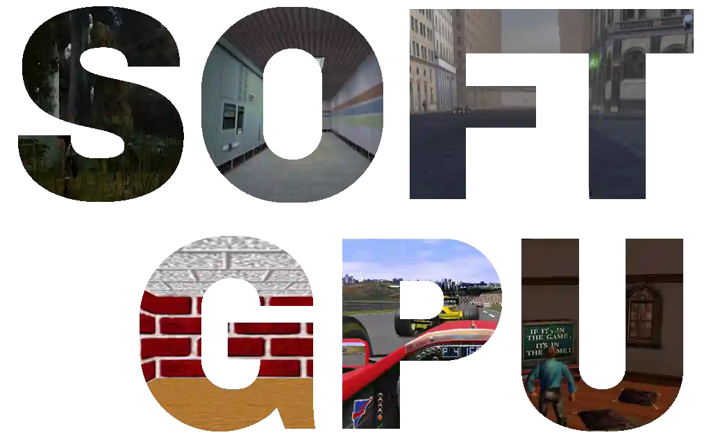

This is ready-to-use compilation of my 4 projects:
- VMDisp9x: https://github.com/JHRobotics/vmdisp9x
- Mesa3D for 9x: https://github.com/JHRobotics/mesa9x
- WineD3D for 9x: https://github.com/JHRobotics/wine9x
- OpenGlide for 9x: https://github.com/JHRobotics/openglide9x

## Requirements
1) Virtual machine with one of these VGA adapter support:
   - A) Bochs VBE (Bochs, VirtualBox, Qemu)
   - B) VMware SVGA-II (VMware, VirtualBox, Qemu)
2) Windows 95/98/Me as VM guest system
   - A) Windows 98/Me - required is last version of DirectX 9 (included in package)
   - B) Windows 95
      - Last version of DirectX 8 (included in package)
      - Visual C runtime (version 6 included in package)
      - OpenGL 95 for versions without `opengl32.dll` (included in package)

## Feature support

| Hypervisor         | Version    | Adapter  | VGA driver  | 32 bpp | 16 bpp |  8 bpp |  HW 3D  | Sound drivers     |
| :----------------- | :--------: | :-----:  | :---------: | :----: | :----: | :----: | :-----: | :---------------- |
| Oracle VirtualBox  | 6.1, 7.0   | VboxVGA  |     ✔      |   ✔   |   ✔   |   ✔   |   ❌    | SB16, AC97        |
| Oracle VirtualBox  | 6.1, 7.0   | VboxSVGA |     ✔      |   ✔   |   ✔   |   ✔   |   ✔    | SB16, AC97        |
| Oracle VirtualBox  | 6.1, 7.0   |  VMSVGA  |     ✔      |   ✔   |   ✔   |   ✔   |   ✔    | SB16, AC97        |
| VMware Workstation | 17         |    -     |     ✔      |   ✔   |   ✔   |   ⚠   |   ✔    | SBPCI128          |
| QEMU               | 7.x, 8.0   |   std    |     ✔      |   ✔   |   ✔   |   ✔   |   ❌    | adlib, SB16, AC97 |
| QEMU               | 7.x, 8.0   |  vmware  |     ✔      |   ✔   |   ❌   |   ❌   |   ❌    | adlib, SB16, AC97 |


## Download
ISO image or ZIP package can be downloaded on release page: https://github.com/JHRobotics/softgpu/releases/

## Installation:
0) Setup the Virtual Machine
1) Copy installation files on formatted HDD and apply **patcher9x** [Optional but recommended]
2) Install the Windows 95/98/Me [Windows 98 SE is recommended]
3) Run setup with `softgpu.exe`
4) [optional] Install audio drivers (if using AC97 sound card) and USB (if you added USB controller)
5) [only if you have AC97 sound card] Reinstall DirectX again = AC97 replacing some DX files, but they are not working with newer DX versions
6) Have fun!

## VirtualBox VM setup with HW acceleration
1) Create new VM selecting *Machine -> New* in menu
2) Type: Microsoft Windows, Version: Windows 98
3) Base memory: 512 MB (256 MB is minimum, but more 512 MB isn't recommended without additional patches!), CPU: 1
4) Disk size: recommended is at least 20 GB for 98/Me (you can select less, but HDD becomes full faster). Select 2 GB if you plan install Windows 95. Tip: If you storing virtual machine on classic HDD, check *Pre-allocate Full Size*, because it leads to lower disk image fragmentation.
5) Finish wizard
6) Open VM setting
- In **General** change *type* to **Linux** and *version* to **Other Linux (32-bit)** => This setting haven't any effect to hardware configuration but allow you to set GPU type through GUI.
- Now in *Display*
  - Set *Graphic Controller* to **VMSVGA**
  - set video memory to ~**128 MB**~ **64 MB** (VBox sometimes turn off GPU HW acceleration if this value is lower), currently for compatibility setting is 64 MB or less recommended. More on [this issue](https://github.com/JHRobotics/vmdisp9x/issues/2) and more about [VRAM usability](https://github.com/JHRobotics/vmdisp9x#vram-size).
  - Check **enable 3D Acceleration**
7) Optional adjustment
- set USB controller to USB 1.1 (OHCI) for 98/Me, or turn USB off for 95
- Audio controller set to **SoundBlaster 16** for 95 ~and 98~ or **AC 97** for 98 and Me (working drivers for Windows 98 are [below](#extra-drivers).
8) Disable VMSVGA10 **(VirtualBox >= 7.0 only)**
- Open command line
- (on Windows) navigate to VirtualBox installation directory (default: *C:\Program Files\Oracle\VirtualBox*)
- Enter this command where *My Windows 98* is your Virtual Machine name
```
VBoxManage setextradata "My Windows 98" "VBoxInternal/Devices/vga/0/Config/VMSVGA10" "0"
```
9) Install system - Windows 98 SE is highly recommended (for newer CPU, you need my patch: https://github.com/JHRobotics/patcher9x)
10) Insert SoftGPU iso (can be downloaded in Releases) and run `softgpu.exe`
11) Click on *Install!*
12) You maybe need some reboots (after MSVCRT and DX installation) and run `softgpu.exe` again.
13) After complete and final reboot system should start in 640x480 in 256 colours
14) Right click on desktop, Properties -> Settings and set the resolution (which you wish for) and colours:
- to 32 bits for 98/Me, because only in 32 bit real HW screen acceleration works and applications are much faster
- to 16 bits for 95, because 95 can't set colour depth on runtime (reboot is required) and lots of old applications can't start in 32 bits (all Glide for example)
15) Verify settings:
- OpenGL: run `glchecker.exe` in `tools` on SoftGPU CD
  - If renderer is **SVGA3D**, you have HW acceleration, congratulation!
  - If renderer is **llvmpipe**, you have still SW acceleration, but at least accelerated by SSE (128 bits) or AVX (256 bit)
  - If renderer is **softpipe**, you have SW acceleration and running on reference (but slow) renderer, SIMD ins't accesable somehow, or you on 95, where is softpipe renderer by default, even if SIMD hack is installed (more in Mesa9x documentation: https://github.com/JHRobotics/mesa9x).
  - If program crash on loading screen, you are on MS software OpenGL renderer (run **wgltest.exe** and check value `GL_RENDERER`). If driver is correctly installed this indicates problem with loading `mesa3d.dll`, usually MSVCR missing, or you install SSE instrumented driver or Windows 95 without SIMD95.
  - If program can't start by missing `MSVCRT.DLL` install MSVCRT (part of Internet Explorer >= 4 too)
- DirectX:
  - On 98 you can run **dxdiag** (Start -> Run -> type `dxdiag`) and check all tests
  - On Me you can still run **dxdiag**, but you can only check DX8 and DX9, because we cannot easily replace system `DDRAW.DLL`. But DX6 and DX7 games should usually run without problems
  - On 95 you can still run **dxdiag**, but if you run test, you only see black screens, but again, games (if supporting 95) games should usually run

## WMware Workstation setup with HW acceleration
SoftGPU with HW acceleration was tested only with lasted version of VMware Workstation (17.0.0 build-20800274), if you'll be successful with older version or free VMware player, please let me know.

### General information
- Use **Windows 98 SE**, newer Mesa is not currently working in 95 and Windows 98 FE (first edition) hasn't supporting WDM sound cards so you might have a problem with sound.
- **Fresh install**, Windows 9x doesn't like hardware changes and if you import import VM from somewhere, strange problems may occur.
- **no VMware additions**, ~because they only contain basic display driver,~ contain mouse integration driver and tray program which **is replacing display driver to VMware default display driver** [and some integration utilities](https://github.com/JHRobotics/softgpu/issues/14).  If you want mouse integration driver (but is useless for gaming with mouse) alone driver is [listed below](#extra-drivers).
- set as hardware compatibility **Workstation 9.x** and VM type **Windows 2000 Server**. VMware in other cases is comparing installed addition tools version and features with hypervisor version and if they don't match refuses to expose SVGA 3D commands to guest.

### Step by step guide
1) Create new VM - from menu File->New Virtual Machine
2) In wizard choose *Custom (advanced)* click on next:
  - As *Hardware compatibility* select **Workstation 9.x** (important)


  - Select *I will install the operating system later.*
  - As *Guest operating system* choice **Microsoft Windows** and as *Version* select **Windows 2000 Server** (important)

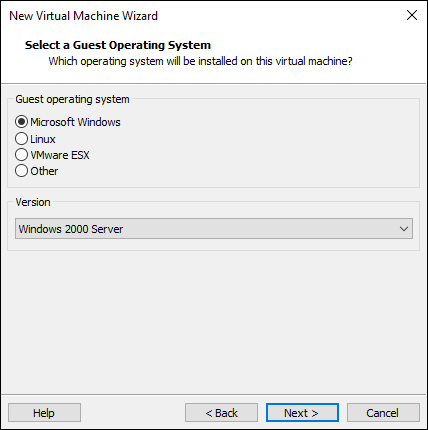

  - Type VM name and number of processors keep on *1*
  - Set the memory to 512 MB (but without additional patches not more!)
  - Network choice is your own (default NAT should work all cases) and SCSI Controller keep on **BusLogic**
  - set *Virtual disk type* to **IDE** (important)
  - create new virtual disk and set space at last at 20 GB (but lower than 127 GB without extra patches!)
  - type or keep HDD file name and at last page before finish click on *Customize Hardware*
3) Now VM needs to be a bit reconfigure:
  - click on *Add...* and **Floppy drive**

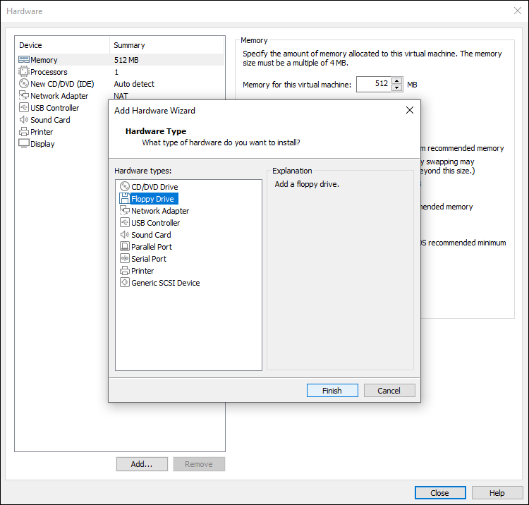

  - click on *USB Controller* and set *USB compatibility* to **USB 1.1** or remove USB controller completely
  - click on *Display* and check **Accelerate 3D graphics**

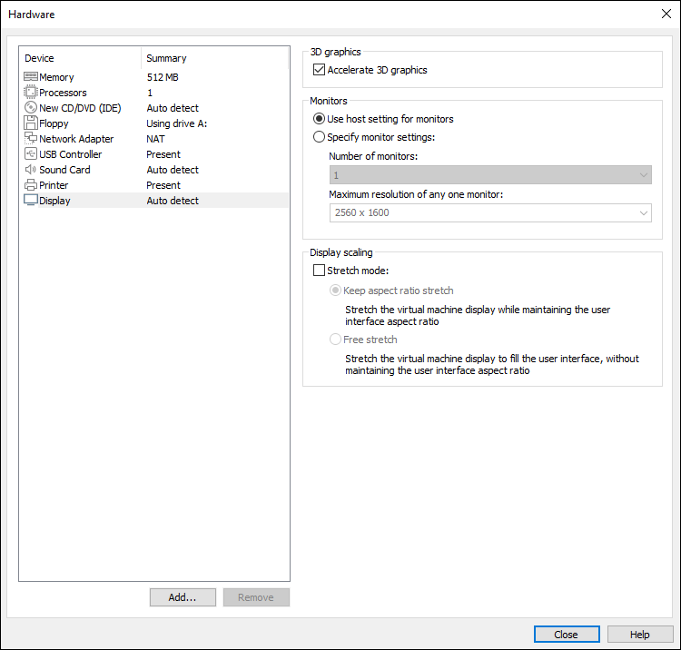

  - (optional) click on *Printer* and click *Remove* (if you don't plan to use this feature, you'll save yourself from a pointless warning message)
  - click on *New CD/DVD (IDE)* and point *Use ISO image file* to your Windows 98 installation CD ISO.
  - (optional) click on Floppy and point *Use floppy image file* to your boot floppy (only if you plan boot floppy)
4) Click on *Close*, *Finish* and Power on machine
  - TIP: if you wish customize boot order, right click on the new VM, choose *Power* and *Power on to Firmware* - VM will boot to environment very close to common PC BIOS.

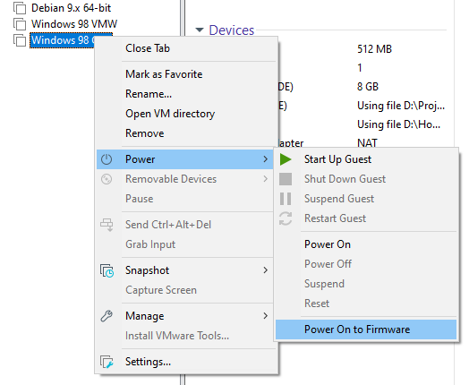

5) Install the Windows 98 - this step is really pain, VMware VM in BIOS VGA mode is hyper slow and mouse isn't usable - you have navigate through installation by keyboard (`TAB`, `Shift`+`TAB`, cursor keys, `Enter`).
	- TIP: apply [patcher9x](https://github.com/JHRobotics/patcher9x). If you have Intel 11th gen. CPU or newer or AMD Ryzen (any model) or other AMD ZEN architecture CPU and newer, this is necessary.
6) After installation isn't system very usable until you'll install GPU driver! So, insert **SoftGPU iso** (can be downloaded in Releases) and run `softgpu.exe`.
7) Click on *Install!*
8) You maybe need some reboots (after MSVCRT and DX installation) and run `softgpu.exe` again.
9) After complete and final reboot system should start in 640x480 in 32 bits per pixel colors.
10) If you have still mouse trouble, open *Device Manager* (by cursor keys select *My Computer* and press `Alt`+`Enter` to open properties), then disable all *HID-compliant mouse*. Reboot VM after done!

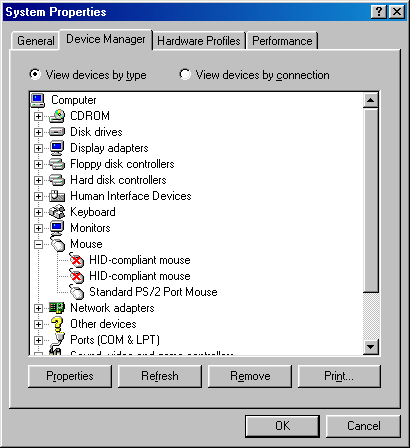

11) Use `glchecker.exe` to verify settings

## QEMU
Hardware 3D support isn't available yet with QEMU. 2D driver now works with QEMU `-vga std` or `-vga vmware`. But main problem with QEMU is bad detection of a PCI bus. If the PCI bus is detected badly, system won't enumerate most of device - VGA adapter, sound and network card and even IDE bus.

### PCI bus detection fix
1) Open Device Manager and locate *Plug and Play BIOS* (Exclamation mark should be on it)

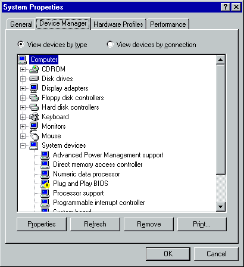

2) With this device selected click on *Properties*, select *Driver* tab and click on *Update driver*

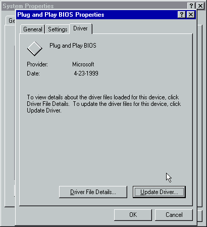

3) In Wizard select second option (*Display a list of all drivers in specific location, ...*)


4) Select *Show all hadrware* and from models list choose **PCI bus**, click on *next*, confirm 
warning message and reboot computer.


5) After reboot, system will ask you for drive on every new discovered device. All you need to do, is select *Search for the best driver...* and clicking on *next*. Please don't select new or updated drivers here - you can do it later. You may need reboot computer several times.

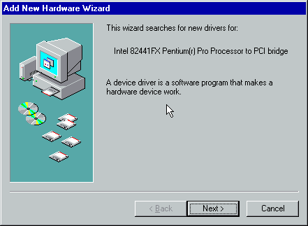
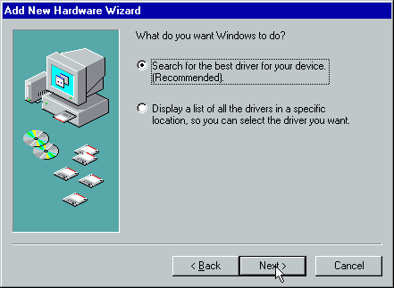

6) You will be asked for VGA driver and unknown device drivers. Still select default generic driver here!

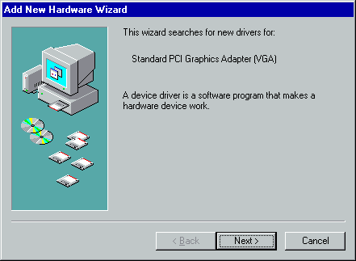
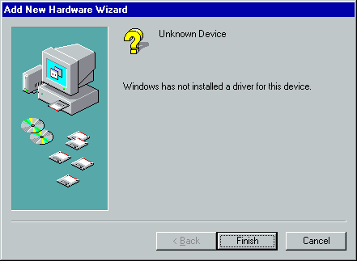

7) After last reboot open *Device manager* again - as you see, you have 2 VGA cards now, so select *Standard Display Adapter (VGA)* (the working one) and click on *Remove*.

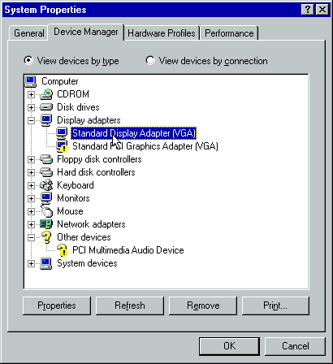

8) After reboot (again), you have working system now and you can install SoftGPU and other drivers.

## Bugs
Currently there are known these limitations:

### Vertex Shaders
Vertex shaders not working correctly with HW acceleration. You can see it, for example, with 3D Mark 2001/2003 tests. Using shaders is very rare in DirectX 8 games, but very common in DirectX 9 games (on other hand, these are usually games after Windows 9x era). As temporary solution you can turn off HW acceleration (but rendering will be much slower).

### Windows 95 support
Windows 95 support is limited - SoftGPU works, but there lots of extra bugs will appear and if you haven't any special reasons for using Windows 95 use recommended Windows 98 Second edition instead.

### Other bugs
There are many bugs in individual components, please post them to individual repositories based on bugged application (DirectX, Glide, OpenGL).

But still, please be patient. SoftGPU compatibility target is about a decade of intensive HW and SW development (from DOS direct VGA/VESA access, SW rendering through GDI, DirectDraw, OpenGL, Glide, DirectX, OpenGL again). After all, there will still applications that cannot be run anyway because there are written for very individual SW/HW combinations.

## General tips
There are some tips without direct relation to SoftGPU but they can improve the user experience with MS Windows 9x OS.

### Fresh install
Prefer new installation over copy older installations done on different (even virtual) HW.

### Copy Installation to HDD before run setup
If you installed Windows 9x from CD, on near every system change your will be asked to insert Install CD. You can avoid it if you prepare HDD manually, copy installation from CD and run `setup.exe` from `C:` drive.

All utilities you need are on [patcher9x](https://github.com/JHRobotics/patcher9x) boot floppy. The short procedure follows:

- insert *patcher9x* floppy to floppy driver and Windows Installation CD to CD driver. Boot from floppy drive
- run `fdisk` and create primary dos partition (it wizard type program, just keep pressing `1`, `Y` and finally `ESC`).
- reboot after `fdisk` finish
- format HDD, copy files, install necessary patches and run the setup using following commands:
```
format C:
xcopy /v D:\win98\ C:\install\win98\
patch9x C:\install\win98 -auto
C:
cd install\win98
setup /ie /nm
```
Explanation: The `/v` switch with `xcopy` means *verify*. The `/ie` switch with `setup` means *skip recovery floppy creation* and `/nm` means *no machine check* - this is necessary because in Patcher9x boot floppy is using FreeDOS and MS setup program cannot determine RAM size without MS memory manager.

Now *setup* automatically runs `scandisk` and after complete it you can continue with installer GUI. You can also remove floppy and CD from drive at this point.

### Turn on DMA
Windows by default using interrupts to access HDD and CD drive. This is especially slow in the HW accelerated virtual machines because every interrupt will stop executing visualisation engine and hand over access to hypervisor to solve it and after that it'll be need to restart visualisation engine again. Time consumed by interrupts depends on visualization technology for example in QEMU + kvm is HDD access very slow equally VirtualBox + Hyper-V and combination QEMU + Hyper-V is downright painful. Fortunately there is DMA transfer of whole memory block instead of individual bytes. Unfortunately you have to enable it manually.

You can turn it on in Device Manager on HDD properties enable `DMA` checkbox. Do it the same for CD driver and reboot VM for applying changes.

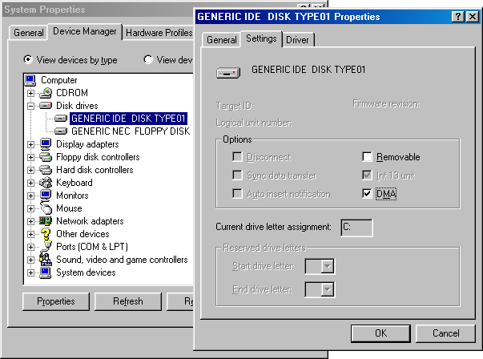


### Change logon to Windows Logon
After install network card you are asked every time to enter the credentials - but this is not credentials to the computer but to the network (you can also skip this by press `ESC`). If you don't plan to install NT server as other VM and runs ancient network sharing, this is only annoying thing. You can turn it off in *Control panel* -> *Network* and change *Primary network logon* to **Windows Logon**.

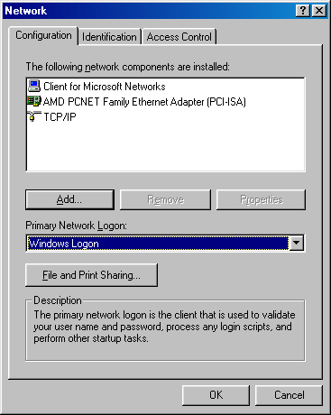

## Extra drivers
These are links to some extra drivers for VM:
- [AC97 (version 3.62)](https://files.emulace.cz/ac97_362.zip) - for QEMU and VirtualBox
- [SB PCI 128](https://files.emulace.cz/sbpci_98se.exe) - for VMware Workstation
- [VMware mouse driver](https://files.emulace.cz/vmmouse.zip) ([floppy version](https://files.emulace.cz/vmmouse.ima))

If you wish download these drivers from Windows 9x directly, you can use these links (simply replace https -> http):
```
http://files.emulace.cz/ac97_362.zip
http://files.emulace.cz/sbpci_98se.exe
http://files.emulace.cz/vmmouse.zip
```

If you need tool for decompressing ZIP and other archives, there is 7-Zip in version with Windows 98 compatible:
```
http://files.emulace.cz/7z920.exe
```


## Compilation from source
1) You need MINGW and *GNU make* to build *softgpu.exe*
2) You need all development tool to compile all other component (see README.md in individual repositories)
3) Compile softgpu.exe by type `make`
4) Compile VMDisp9x and copy files `boxvmini.drv`, `vmwsmini.drv`, `qemumini.drv`, `vmwsmini.vxd`, `vmdisp9x.inf` and place them to `driver/win95` and `driver/win98me` folder
5) Compile Mesa9x for Windows 95 (e.g., without SSE) and copy and rename files to following schema
   - `vmwsgl32.dll`       => `driver/win95/vmwsgl32.dll`
   - `opengl32.w98me.dll` => `driver/win95/extra/opengl32.dll`
   - `mesa3d.w98me.dll`   => `driver/win95/mesa3d.dll`
   - `glchecker.exe`      => `tools/glchecker.exe`
   - `icdtest.exe`        => `tools/icdtest.exe`
   - `wgltest.exe`        => `tools/wgltest.exe`
   - [folder] `glchecker` => `tools/glchecker`
6) Compile Mesa9x for Windows 98 and Me (eq. with SSE, optimized for Core2 or Westmere) and copy these files
   - `vmwsgl32.dll`       => `driver/win98me/vmwsgl32.dll`
   - `opengl32.w98me.dll` => `driver/win98me/extra/opengl32.dll`
   - `mesa3d.w98me.dll`   => `driver/win98me/mesa3d.dll`
7) Compile Wine9x for Windows 95 and copy
   - `ddraw.dll`          => `driver/win95/ddraw.dll`
   - `ddrawme.dll`        => `driver/win95/ddrawme.dll`
   - `d3d8.dll`           => `driver/win95/d3d8.dll`
   - `d3d9.dll`           => `driver/win95/d3d9.dll`
   - `dwine.dll`          => `driver/win95/dwine.dll`
   - `wined3d.dll`        => `driver/win95/wined3d.dll`
8) Compile Wine9x for Windows 98+Me and copy
   - `ddraw.dll`          => `driver/win98me/ddraw.dll`
   - `ddrawme.dll`        => `driver/win95/ddrawme.dll`
   - `d3d8.dll`           => `driver/win98me/d3d8.dll`
   - `d3d9.dll`           => `driver/win98me/d3d9.dll`
   - `dwine.dll`          => `driver/win98me/dwine.dll`
   - `wined3d.dll`        => `driver/win98me/wined3d.dll`
9) make `ddreplacer.exe` (by typing make ddreplacer.exe in Wine9x)
10) Extract original ddraw.dll from DX8 redistributable for W95 and type
```
ddreplacer path/to/extracted/ddraw.dll ddr95.dll
```
   - copy `ddr95.dll` => `driver/win95/dx/ddr95.dll`
   - copy `ddr95.dll` => `driver/win98me/dx/ddr95.dll`
11) Extract original ddraw.dll from newer DX9 redistributable (doesn't matter if it's final one, this file doesn't seem to change often) and type
```
ddreplacer path/to/extracted/ddraw.dll ddr95.dll
```
   - copy `ddr98.dll` => `driver/win95/dx/ddr98.dll`
   - copy `ddr98.dll` => `driver/win98me/dx/ddr98.dll`
12) Compile OpenGlide9x for Windows 95 and copy
   - `glide2x.dll`        => `driver/win95/glide2x.dll`
   - `glide3x.dll`        => `driver/win95/glide3x.dll`
13) Compile OpenGlide9x for Windows 98 and copy
   - `glide2x.dll`        => `driver/win98me/glide2x.dll`
   - `glide3x.dll`        => `driver/win98me/glide3x.dll`
14) Edit both `driver/win95/vmdisp9x.inf` and `driver/win98me/vmdisp9x.inf` and uncomment files and that you added. CopyFiles options have to look like:
```
CopyFiles=VBox.Copy,Dx.Copy,DX.CopyBackup,Voodoo.Copy
```
and
```
CopyFiles=VMSvga.Copy,Dx.Copy,DX.CopyBackup,Voodoo.Copy
```
and
```
CopyFiles=Qemu.Copy,Dx.Copy,DX.CopyBackup,Voodoo.Copy
```

15) place redistributable to redist folder
16) Edit `softgpu.ini` for final paths review
17) Create ISO file place to it:
   - file `softgpu.exe`
   - file `softgpu.ini`
   - folder `driver`
   - folder `redist`
   - folder `tools`
   - *readme* and *licence* file
18) Mount ISO to virtual machine and enjoy it!
